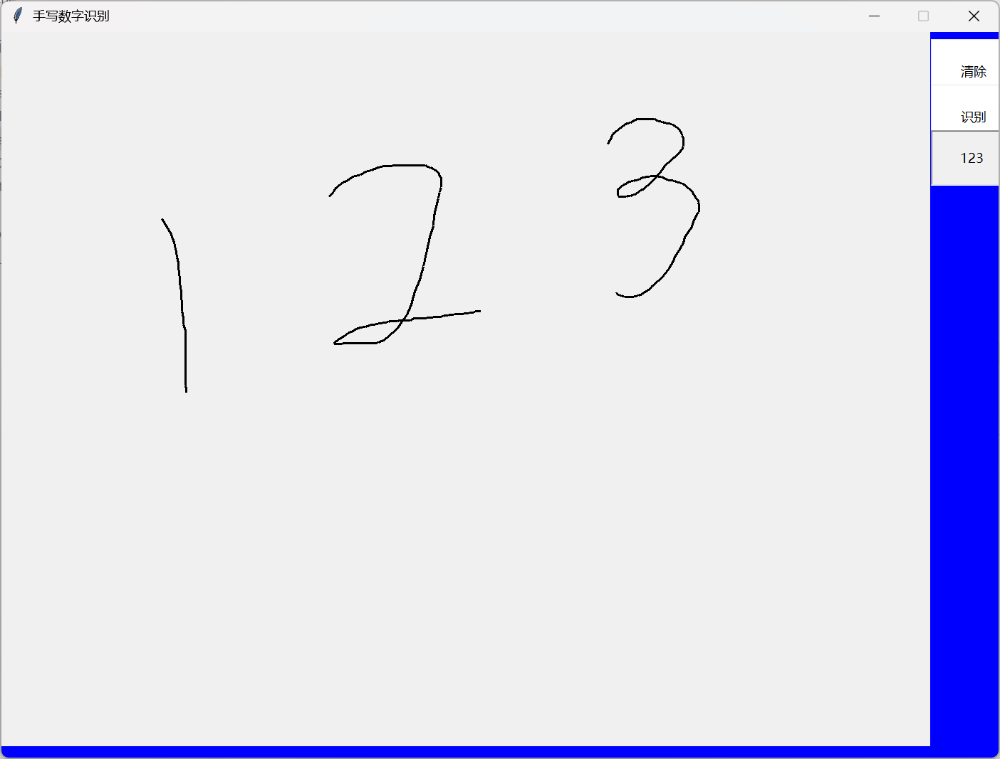

### 说明:
- 这个是我大一学习机器学习弄得,现在才上传因为一个人没必要上传github,本地就行了
### 依赖:
- pytorch
- opencv
- pyautogui
### 步骤:
- 先利用MINIST数据集和卷积神经网络训练好模型存储
- 制作gui框架,可以接受输入
- 用截屏框架把画板截图
- 对图像进行预处理
- 使用opencv把不连续的数字分开
- 把分开的数字进行压缩成固定大小,位置居中(模拟训练数据)
- 我这里进行了二极化
- 传入训练好的模型得出概率
